# 1	Introduction and Motivation of the application
Data visualization is the graphical representation of information and data. It has been an important factor in data analytics pipeline, to reveal insights that are often difficult to be delivered in other forms. It is commonly used in various scenarios, such as data cleaning, exploring data structure, detecting pattern, identifying trends and clusters. It provides organizations and practitioners a handy tool to analyse data and enables them to make informative decisions based on insights gained. Understanding the current state of data visualization is crucial. It gives organizations and practitioners in the field a better idea of where data visualization stands today, and where it’s headed. On the other hand, it helps people who have an interest in data visualization know how to enter the field.

# 2	Objective

In this research study, we will build a R Shiny application to illustrate the current trend of data visualization. The goal is to draw a comprehensive picture of data visualization for organizations, practitioners and people having an interest in data visualization, by analysing Annual Data visualization Community Survey.
The analysis and visualization consist of three parts: interactive exploratory data analysis, cluster analysis and association analysis.
•	The exploratory data analysis aims to summarize the main characteristics of the measures and generate statistical graphics to visualize them.
•	The cluster analysis aims to discover similarities in respondents based on tools they used and hours they spent on data visualisation; to group data visualisation tools and visualisation activities.
•	The association analysis aims to provide DataViz practitioners a guidance what are the commonly used combination of tools.

# 3	Review and Critic on Past Works

Duis nec purus sed neque porttitor tincidunt vitae quis augue. Donec porttitor aliquam ante, nec convallis nisl ornare eu. Morbi ut purus et justo commodo dignissim et nec nisl. Donec imperdiet tellus dolor, vel dignissim risus venenatis eu. Aliquam tempor imperdiet massa, nec fermentum tellus sollicitudin vulputate. Integer posuere porttitor pharetra. Praesent vehicula elementum diam a suscipit. Morbi viverra velit eget placerat pellentesque. Nunc congue augue non nisi ultrices tempor.

## 3.1  Interactive Exploratory Data Analysis (IEDA)

In statistics, exploratory data analysis is an approach to analyze data sets to summarize their main characteristics. We are going to use statistical graphics to visualize the results of IEDA. Past works focused on numerical variables and explored different facility provided by the “ggplot” package.  
There are two main areas to improve.[@William2017,@HADLEY]
1.	The focus on “ggplot” package does not provide interactivity.
2.	The focus on numerical variables restricted the scenarios that the results could be applied to.

## 3.2  Latent Class Analysis

Since this is a survey data, columns in the dataset all have categorical variables. It’s not appropriate to use clustering techniques such as dendrogram and k-means clustering method. Instead, Latent class analysis (LCA), which was commonly used for the analysis of multivariate categorical data, is taken into considerations in this case. LCA offers a way to uncover hidden groupings (latent classes) in multivariate categorical data, by applying maximum likelihood method to calculate the probability that a case will fall in a particular latent class. This unsupervised clustering algorithm can be achieved by poLCA package in R. In a research paper written by Linzer and Lewis, they had illustrated multiple examples of LCA with detailed explanation in R, using built-in carcinoma, cheating, election, gss82 and values dataset [@LL2011]. However, they did not visualise the output of LCA. In this project, ggplot2, plotly and heatmaply packages were used to visualise LCA’s outputs, class-conditional outcome probabilities (LCAoutput$probs) and each observation’s posterior class membership probabilities (LCAoutput$posterior).

## 3.3  Association Analysis

### 3.3.1  Association rule mining

Association rule mining is rule-based method to discover association between different objects in a set, and frequent patterns in a database. Commonly used terminologies in association analytics include itemset, support, confidence, lift, whereas, 
-	Itemset is one item or combination of items. K-itemset means an itemset with k items. One instance of itemsets is typically called a “transaction”. 
-	Frequency percentage of X over total number of transaction records, N.  Support (X) = frequency(X)/N  
-	For a rule A=>B, confidence shows percentage in which B occurs when A occurs. 
-	Confidence(A=>B)=P(A∩B)/P(A)=frequency(A,B)/frequency(A)
-	Lift gives correlation between A and B in the rule A=>B. Correlation shows how one item-set A effects the item-set B.  Lift of 1 represents independence between A and B. Larger than 1 means presence of A gives positive effect and less than 1 represent negative effect. 

APRIORI algorithm is used for association rule mining. It starts with frequent itemset generation and find all frequent item-sets satisfy pre-determined min-support threshold. List all association rules from frequent item-sets. Calculate support and confidence for all rules and keep rules that satisfy min_support and min_confidence threshold. For each rule, we can use lift to examine the correlation of itemset A and itemset B.[@agrawal1994] 

Association rule mining is popularly implemented with R extended packages, arules.[@R-arules] It always generate a large number of association rules. Researchers have developed, studied, and implemented novel methods to visualize the result with “arulesViz”.  It does not only support common association visualization types e.g. "scatterplot", "matrix" and "graph", also support "two-key plot", "matrix3D", "mosaic", "doubledecker", "paracoord", "grouped", and also an interactive component “ruleExplorer”. [@R-arulesViz] Researchers have studied association rule visualization with hierarchical groups.[@michael2017] However, it comes to a limitation to explore the association for a subgroup of the transactions, by filtering multiple parallel information. 

This study target to customize existing ruleExplorer function with additional interactivity component to focus on selected subgroup. Our first iteration flow is to read file into R, followed by filtering and saving selected data, and then read into R as transactions. However, every filtering would trigger a temporary file at the server side, which is very time and capacity consuming. The proposed iteration is by incorporating itemset level information using functions from arules. 

### 3.3.2	Parallel Sets – a novel approach to compare multiple item sets information

Parallel sets marry the advantages of two visualisation techniques, parallel coordinates which can display high-dimensional data and using frequencies to represent for the categories. In parallel sets, the width of box between two dimensions reflects the percentage of different category. In R, interactive parallel sets can be achieved by parsetR package. This is a software package built upon R Shiny and its functionalities are quite straightforward.

In the previous work of Kosara, Bendix and Hauser, a customer survey dataset, containing information about 93,872 Austrian households, was used in their case study [@KBH2006]. They deployed parallel sets to illustrate three dimensions that are of particular interest: household types, income and favourite supermarket. The result chart is shown below. Particularly, a histogram was plotted in the middle, showing the frequency distribution of the top and bottom dimensions relative to the middle dimension. In comparison to the demonstration in this case study, parsetR package does not include statistical information on the plot. It would be good if this functionality can be incorporated in parsetR package.

```{r 1, echo=FALSE, fig.align='center',out.width = '100%'}
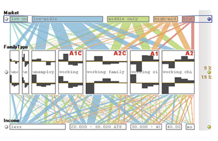
```

# 4	Design framework and Use Case Demonstration

On the top of the interface, we provide a navigation header that enables users to select the analysis they would like to explore – Interactive exploratory design analysis, clustering or association analysis. 

## 4.1  Interactive Exploratory Data Analysis (IEDA)

A drop-down menu is provided under the IDEA header button, which enable the users to select one of the subjects in Demography information, Job and Challenge faced. Once selected, the application will jump to an interface built for that subject. On this interface, a control panel on the left side provides the interactivity for users to select the variable they would like to examine and the variable they would like to group the data. Once selected, a bar chart with error bar will be generated to present the proportion of each value of the variable examined. 

```{r 2, echo=FALSE, fig.align='center',out.width = '100%'}
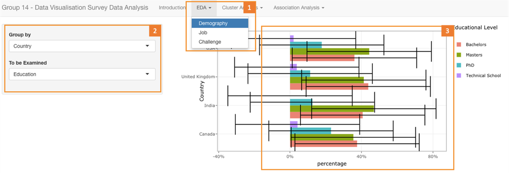
```

## 4.2  Cluster Analysis

Cluster analysis contains four parts as shown below:
1.	On the menu bar, Latent Class Analysis is available under Cluster Analysis section.
2.	For Latent Class Analysis section, three visualisation variations, line plot, stacked bar chart and heatmap, are available for selection. Same data is used for all three different formats. Line plot and stacked bar chart aims to cluster variables, in order to find out what tools belong to the same group and the relationship between varied duration of working on different visualisation tasks, whereas heatmap cluster respondents based on their behaviours (i.e. tools used and hours spent).
3.	For each visualisation format of LCA, slider bar on the left contains a slider input for number of classes. As only 10 frequently-mentioned visualisation tools are included for cluster analysis after data pre-processing, the range of classes available for selection is between 1 and 9. Users can adjust number of clusters to observe the changes and find optimal number of classes, by moving the circle button.
4.	Apart from number of classes available for selection, there are two groups of cluster variables. The first group looks into visualisation tools, which includes Excel, Tableau, R, ggplot2, D3, Python, Pen&Paper, Illustrator, PowerBI and Plotly. With these variables, tools will be clustered into different groups based on respondents’ usage of tools. The second group focuses on hours spent on different data-related activities. More specifically, it considers hours spent on data visualisation, data engineering, data science, design, data preparation and building portfolio. 

```{r 3, echo=FALSE, fig.align='center',out.width = '100%'}
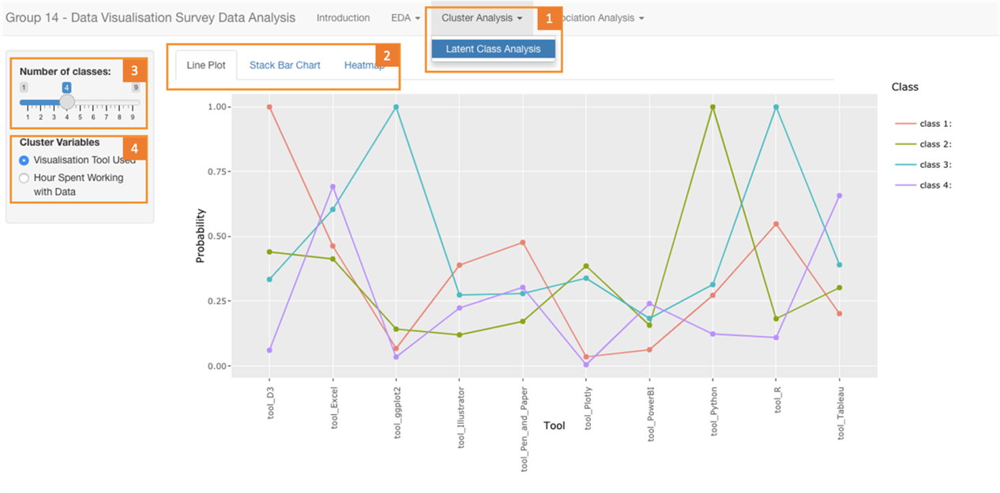
```

## 4.3  Association Analysis

### 4.3.1  Association Analysis

Association Rule Explorer contains four parts as displayed below:
1.	On the left side, it contains multiple demographics selector, using , e.g. education, year of relevant DataViz experience, major, gender, country and salary. After selecting from various dropdown lists and sliderbar, user is required to click “GO!” button to generate subset of transactions and thereafter charts. 
2.	At the middle, there is a ruleExplorer built-in interactive component, which allows user to filter measures (i.e. minimum support, confidence, lift), rule length, and inclusive and/or exclusive items. 
3.	At the right top corner, it is also a ruleExplorer built-in interactive tabbar. This offers various visualization output types. 
4.	Last but not least, area #4 will ideally display selected output chart with desired subset of transactions and satisfying rules.

```{r 4, echo=FALSE, fig.align='center',out.width = '100%'}
knitr::include_graphics("4.png")
```

**(disclaimer: above proposed design is not implemented successfully.)**

### 4.3.2  Parallel Set Chart

Parallel set contains two parts as illustrated below:
1.	On the menu bar, Parallel Set Chart is available under Cluster Analysis section.
2.	Slider bar on the left contains two selection inputs. This allows users to select variables of interest and explore the relationship between two variables, such as role of respondents in organization and usage of tool Excel, or usage of tool Tableau and tool R. Variables consist of undergraduate major, organization area, role, gender, country, yearly pay, Excel, Tableau, R, ggplot2, D3, Python, Pen&Paper, Illustrator, PowerBI and Plotly.

```{r 5, echo=FALSE, fig.align='center',out.width = '100%'}
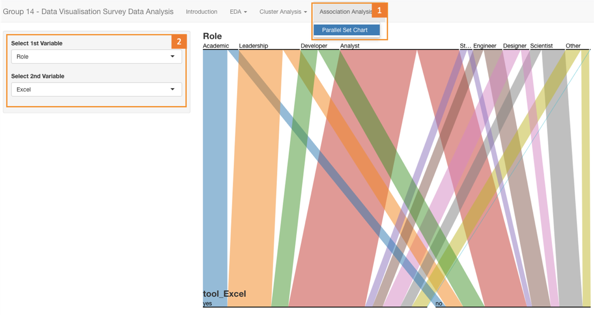
```

# 5 Discussion

In this project, we have explored functions of different R packages to visualize categorical variables. Our R Shiny application incorporates interactivity and provides an application case that is useful for exploring and presenting categorical data.

## 5.1 Bar Chart 1

Generally, there more male data visualisation professionals. India has the largest gap between the number of male data visualisation professionals and the that of female professionals (81%male vs.19% female). USA has the smallest gap between the number of male data visualisation professionals and the that of female professionals 62% male vs.39% female).

```{r 7, echo=FALSE, fig.align='center',out.width = '100%'}
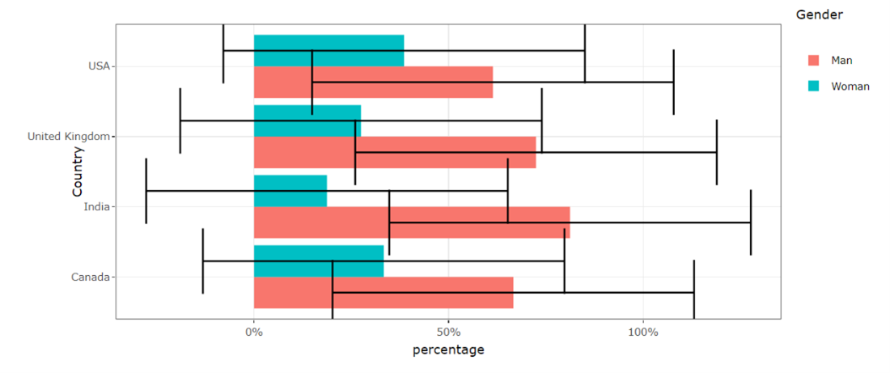
```


## 5.2 Bar Chart 2

Private sector requires and employed highest portion, more than 40%, of dataViz practitioners across USA, UK, India and Canada. This is followed by academic instituitions. 

```{r 9, echo=FALSE, fig.align='center',out.width = '100%'}
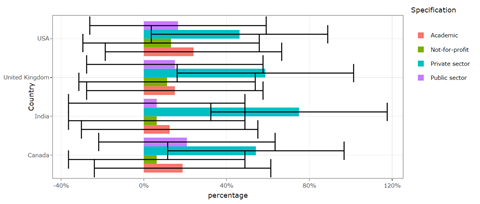
```

## 5.3 LCA - Heatmap

Heatmap allows users to visually capture different groups in survey respondents, based on their usage of visualisation tools. Originally, it’s difficult to use heatmap to visualise categorical data. With posterior probabilities computed from LCA, we are able to cluster respondents into different latent classes and clearly show the groupings on heatmap. Besides, hovering over the plot can see ID of respondents. Thus, an interactive heatmap helps us locate respondent easily.

```{r 11, echo=FALSE, fig.align='center',out.width = '100%'}
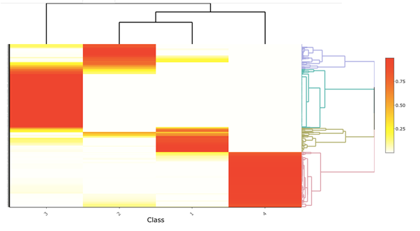
```

## 5.4 LCA – Line Plot

Line plot provides users with a more complete picture of the cluster result, as probabilities of belonging to all different classes are all presented on the graph. Besides, it’s easy to detect whether two categories are from the same group, by observing the trend of the graph. In the example shown below, we can see that ggplot2 and R are highly likely from the same class, class 2. This is obvious looking at the peak of green line and this grouping is reasonable since ggplot2 is a commonly used R package. 

```{r 12, echo=FALSE, fig.align='center',out.width = '100%'}
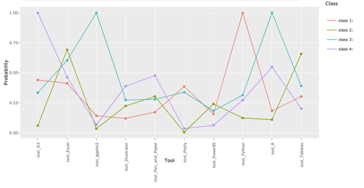
```


## 5.5 LCA – Stacked Bar Chart

100% Stacked bar chart shows the percentage of every sub-category in relation to the total value. This allows users to spot the largest sub-category easily and the difference between sub-categories. According to the below example, python and R belong to very different classes. This is because when using R has 100% probability in class 1, the probability of using python is small, whereas when using python is 100% probability in class 3, the probability of using R is very low.

```{r 13, echo=FALSE, fig.align='center',out.width = '100%'}
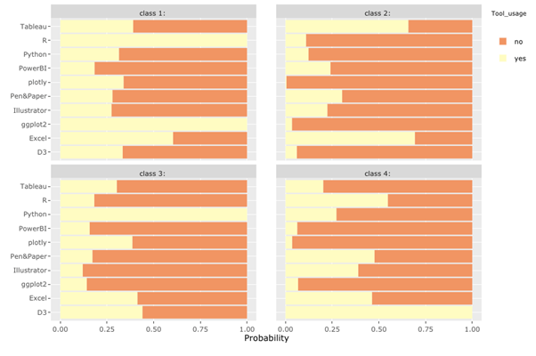
```


## 5.6 Association Analysis

Association rules can help dataViz tool providers to advertise and cross sell products to users who used associated product. It can also help dataViz practitioners to learn new set of tools that be skilled by others. From below chart with a low lift, we can see that the association is quite sparse, there is no clear group of tools that be used by a cluster of users, i.e dataViz practitioners have diverse experience with different set of tools.

```{r 14, echo=FALSE, fig.align='center',out.width = '100%'}
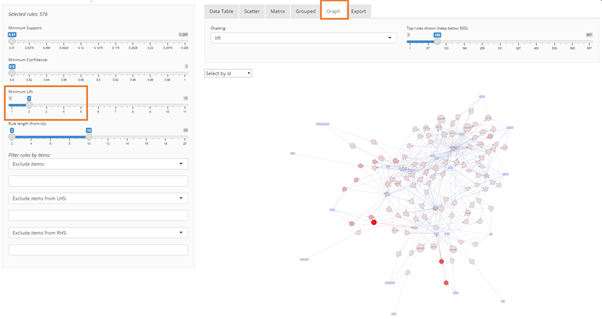
```

The proposed design allows user to select measures such as minimum lift, which shows rules with larger lift, i.e. more significant positive effect for association.

```{r 15, echo=FALSE, fig.align='center',out.width = '100%'}
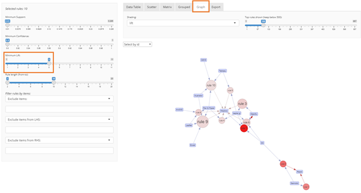
```

# 6 Future Work

We have successfully implemented proposed design in terms of EDA and Cluster Analysis. However, association analysis component is not. We started the first iteration with a Load (raw data)-Transform (clean and filter)-Export&2nd Transform (to transactions)-2nd Load(as transactions) cycle, which triggers a file saving when there is filter change on demographics input. It is very time and capacity-consuming, and the saved file failed to locate to a defined location and caused issue at 2nd loading phase. Then, we did second iteration to offline Load(raw data)-Transform (clean)-Export (to transactions and itemset level labels), followed by a Load(transactions and itemset level information) on ShinyAPP. We should continue to explore and extend our study on 2nd iteration to visualize association rules. 

# 7 References
---
...

