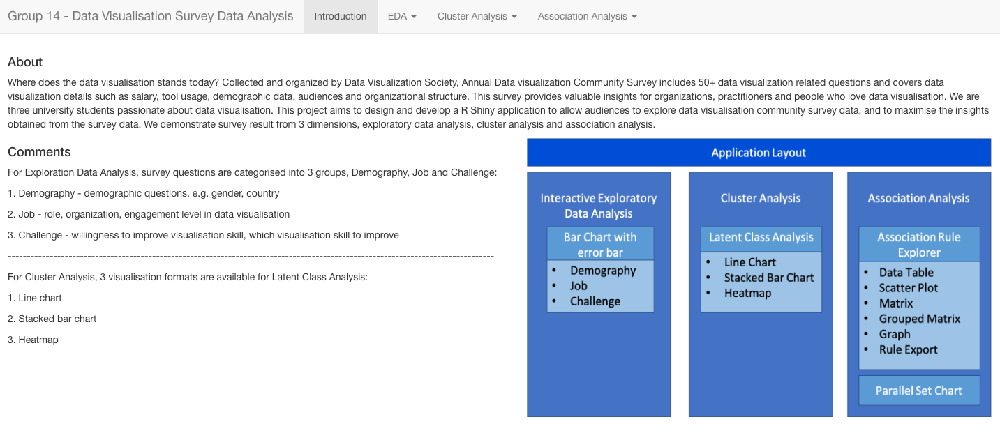
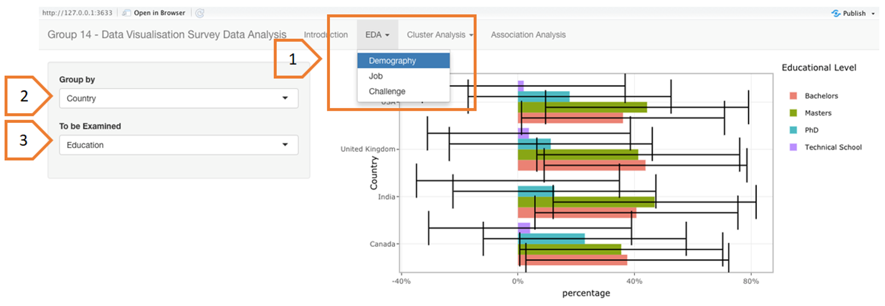
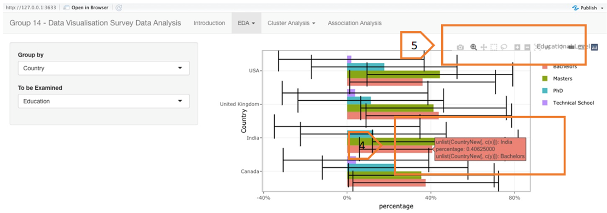
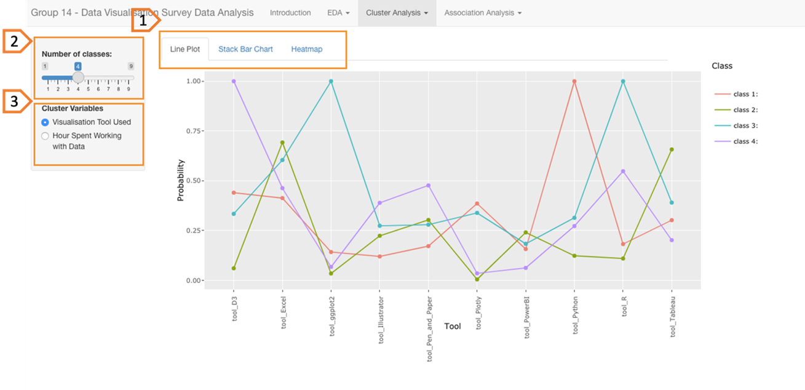
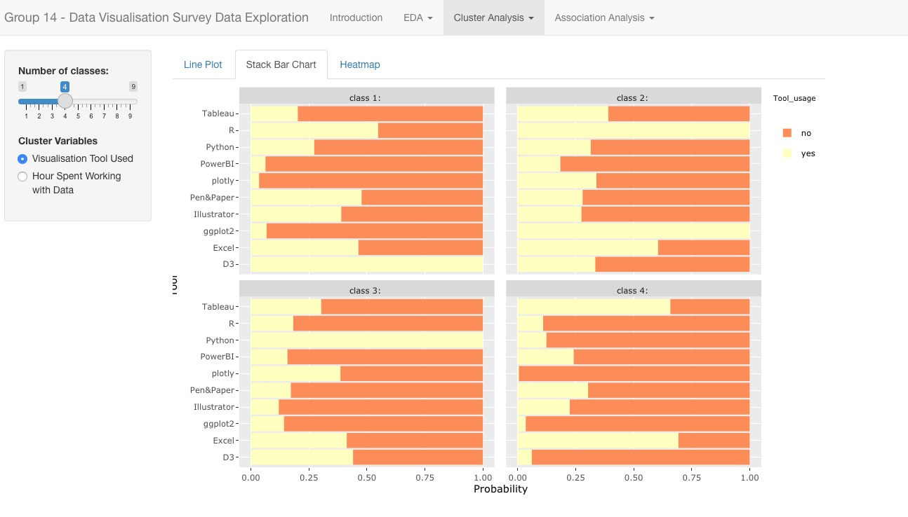
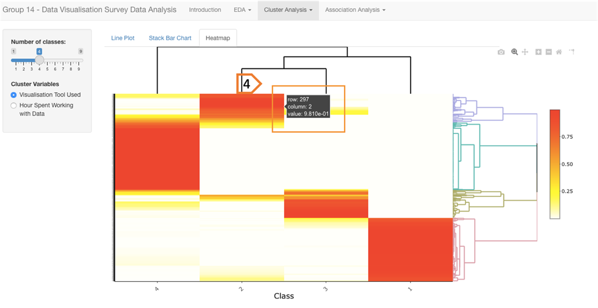
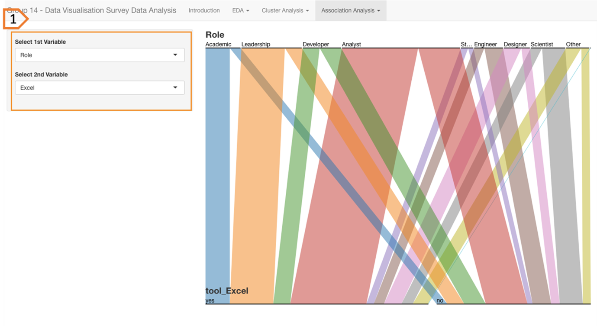

```{r setup, include=FALSE}
knitr::opts_chunk$set(echo = TRUE)
```

### 1. Introduction Page

This page has a short description of our R Shiny Application and an overview of the application layout.

```{r 7, echo=FALSE, fig.align='center',out.width = '100%'}

```

### 2. EDA

Bar chart with error bar allows for exploring categorical data with uncertainty and segregated by demographics variables e.g. country, gender, education level and etc..

```{r 1, echo=FALSE, fig.align='center',out.width = '100%'}

```

[1] Select the desired subject to visualise the distribution of measure values of variables falling under the subject selected. 

[2] Select the group-by variable to examine the distribution of each measure value of the to-be-examined variable grouped by that variable. 

[3] Select the to-be-examined variable to visualise the distribution of each measure value of that variable. 

```{r 2, echo=FALSE, fig.align='center',out.width = '100%'}

```

[4] [5] Explore the handy facility provided by plotly, such as zoom in, hover and information label. 

### 3. Cluster Analysis

Latent class analysis (LCA), which was commonly used for the analysis of multivariate categorical data. LCA offers a way to uncover hidden groupings (latent classes) in multivariate categorical data, by applying maximum likelihood method to calculate the probability that a case will fall in a particular latent class. In our application, 3 visualisation variations, line plot, stacked bar chart and heatmap are available for selection to demonstrate LCA. Same data is used for all three different formats. Line plot and stacked bar chart aims to cluster variables, in order to find out what tools belong to the same group and the relationship between varied duration of working on different visualisation tasks, whereas heatmap cluster respondents based on their behaviours (i.e. tools used and hours spent). 

```{r 3, echo=FALSE, fig.align='center',out.width = '100%'}

```

```{r 4, echo=FALSE, fig.align='center',out.width = '100%'}

```

```{r 5, echo=FALSE, fig.align='center',out.width = '100%'}

```

[1] Select the visualisation format of interest. 

[2] Adjust number of clusters to observe the changes and find optimal number of classes, by moving the circle button. 

[3] Select the cluster variables of interest. There are two groups of cluster variables available for exploration. The first group includes Excel, Tableau, R, ggplot2, D3, Python, Pen&Paper, Illustrator, PowerBI and Plotly. The second group consists of hours spent on data visualisation, data engineering, data science, design, data preparation and building portfolio.  

[4] Hover over the heatmap for more information about the respondents.


### 4. Association Analysis

Parallel sets marry the advantages of two visualisation techniques, parallel coordinates which can display high-dimensional data and using frequencies to represent for the categories. In parallel sets, the width of box between two dimensions reflects the percentage of different category. 

```{r , echo=FALSE, fig.align='center',out.width = '100%'}

```

[1] Select variables of interest to explore the relationship between two variables, such as role of respondents in organization and usage of tool Excel. Variables are undergraduate major, organization area, role, gender, country, yearly pay, Excel, Tableau, R, ggplot2, D3, Python, Pen&Paper, Illustrator, PowerBI and Plotly.