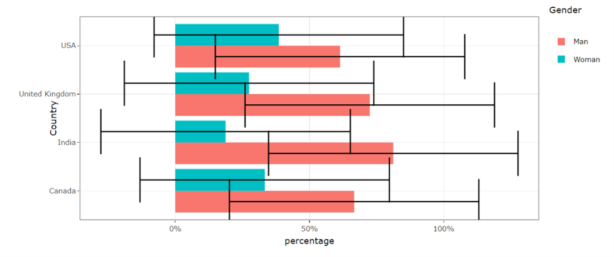
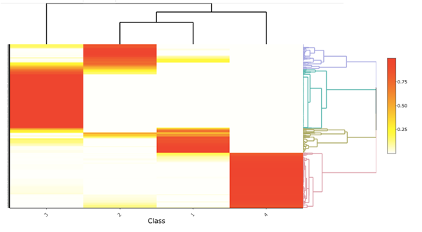
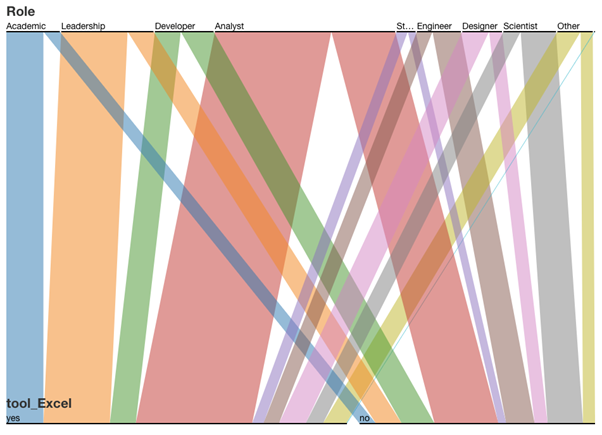

```{r setup, include=FALSE}
knitr::opts_chunk$set(echo = FALSE)
```

# Introduction

Data visualization is the graphical representation of information and data. It has been an important factor in data analytics pipeline, to reveal insights that are often difficult to be delivered in other forms. It provides organizations and practitioners a handy tool to analyse data and enables them to make informative decisions based on insights gained. 

Understanding the current state of data visualization is crucial. It gives organizations and practitioners in the field a better idea of where data visualization stands today, and where it’s headed. On the other hand, it helps people who have an interest in data visualization know how to enter the field.

# Objectives

The analysis and visualization consist of three parts: exploratory data analysis, cluster analysis and association analysis.

1. The exploratory data analysis aims to summarize the main characteristics of the measures and generate statistical graphics to visualize them.
2. The cluster analysis aims to discover similarities in respondents, based on tools they used, hours they spent on data visualisation and their role in organizations.
3. The association analysis aims to provide DataViz practitioners a guidance what are the commonly used combination of tools.

# Approach

```{r 1, echo=FALSE, fig.align='center',out.width = '100%'}
knitr::include_graphics("Approach.png")
```

# EDA

**Bar Chart with Error Bar** allows for exploring categorical data with uncertainty and segregated by demographics variables e.g. country, gender, education level and etc..

```{r 2, echo=FALSE, fig.align='center',out.width = '100%'}

```

# Cluster Analysis

**Heatmap** allows users to visually capture different groups in survey respondents, based on their usage of visualisation tools. Originally, it’s difficult to use heatmap to visualise categorical data. With posterior probabilities computed from LCA, we are able to cluster respondents into different latent classes and clearly show the groupings on heatmap. Besides, hovering over the plot can see ID of respondents.

```{r 4, echo=FALSE, fig.align='center',out.width = '100%'}

```

**Line Plot** provides users with a more complete picture of the cluster result, as probabilities of belonging to all different classes are all presented on the graph. Besides, it’s easy to detect whether two categories are from the same group, by observing the trend of the graph. 

```{r 5, echo=FALSE, fig.align='center',out.width = '100%'}
knitr::include_graphics("5.png")
```

**100% Stacked Bar Chart** shows the percentage of every sub-category in relation to the total value. This allows users to spot the largest sub-category easily and the difference between sub-categories.

```{r 6, echo=FALSE, fig.align='center',out.width = '100%'}
knitr::include_graphics("6.png")
```

# Association Analysis

**Parallel Coordinate** allows users to select two variables and study the association. Usually, association rule mining is based off items. The parallel coordinate in our application is capable to analyse and visualise association between different items, itemset level parameters, or item and itemset level information.

```{r 3, echo=FALSE, fig.align='center',out.width = '80%', out.height="100%"}

```

# Future Works

We have successfully implemented proposed design in terms of EDA, Cluster Analysis, Parallel set for association analysis. However, association rule explorer component is not. We should continue to explore and extend our study on association rule explorers by adding itemset level information to generate transactions fast and to visualize association rules.
